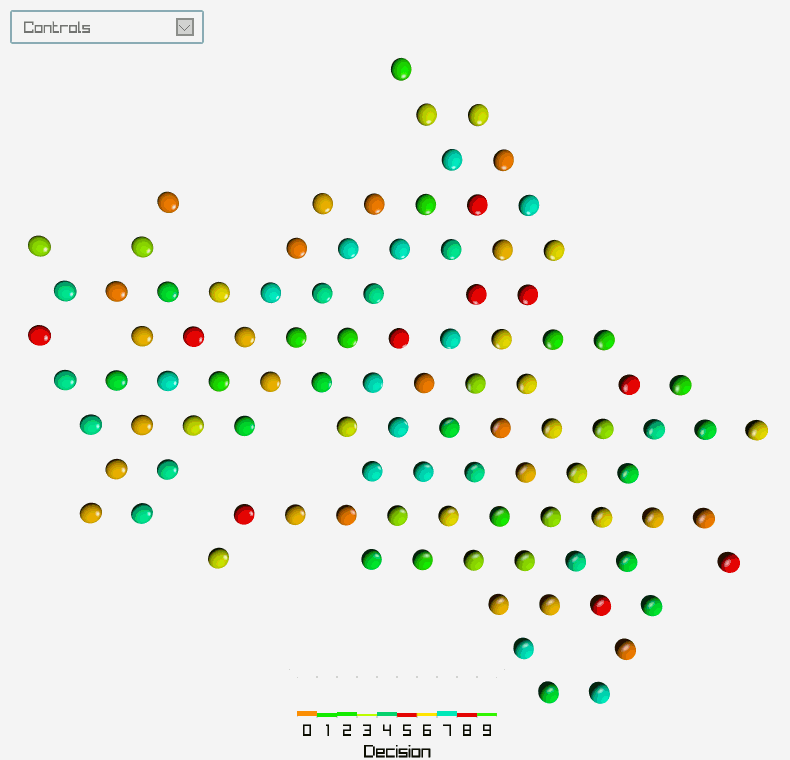
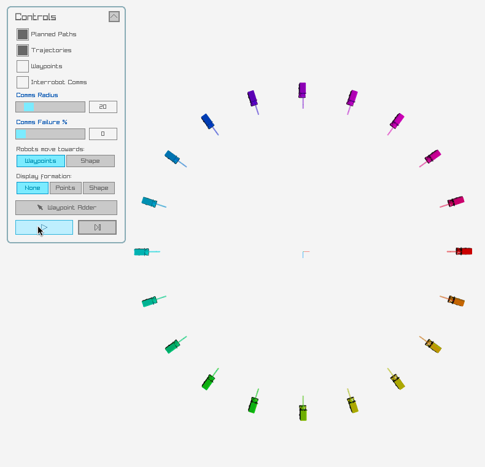
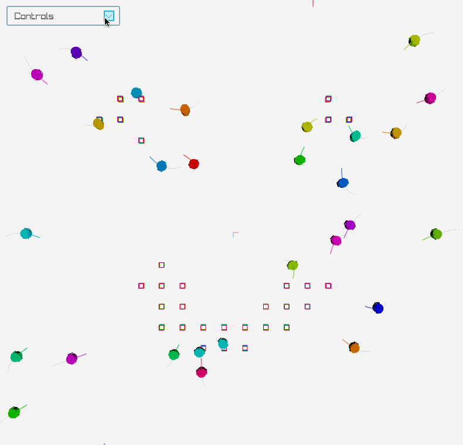
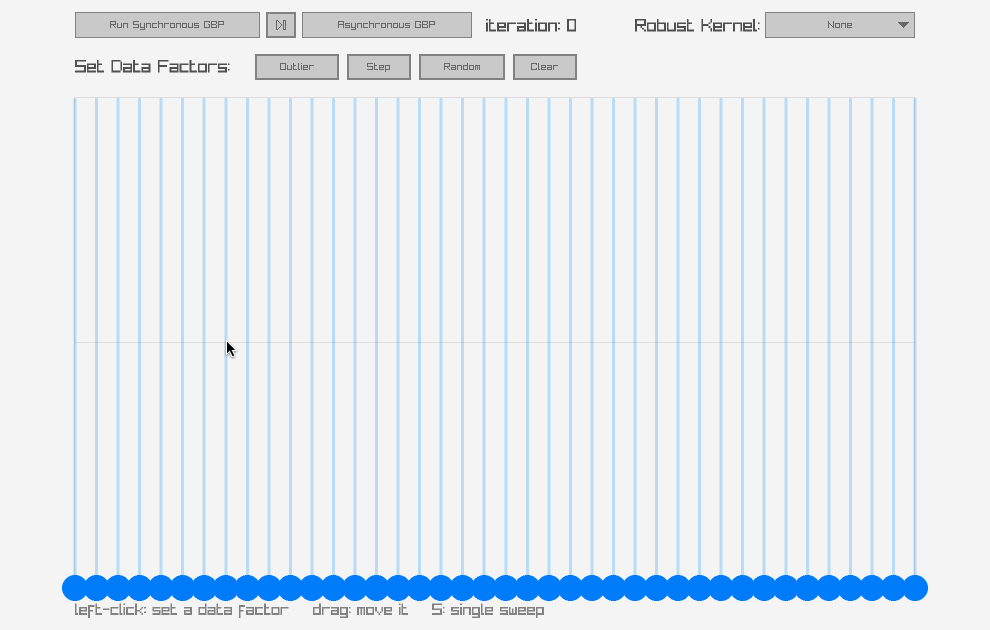

# DANCeRS 
### A Gaussian Belief Propagation (GBP) Library for Optimisation on the Manifold
<p align="center">
  
  
  
  
</p>

This is the official code for [**DANCeRS: A Distributed Algorithm for Negotiating Consensus in Robot Swarms**](https://arxiv.org/abs/2508.18153), presented at ICRA 2026:

*Authors*: [Aalok Patwardhan](www.aalok.uk) and Andrew J Davison

### [**Project Page**](https://aalpatya.github.io/dancers) | [**Web Demo**](https://aalpatya.github.io/dancers/demo) | [**Paper**](https://arxiv.org/abs/2508.18153)

---
## What does it do? 
It is a **Gaussian Belief Propagation (GBP)** library in C++ that also handles these applications:
- [**Distributed Assignnment-free Multirobot Shape Formation**](#2-shape-formation)
- [**Distributed Path planning and collision avoidance (non-holonomic robots)**](#1-path-planning-and-collision-avoidance)
- [**Distributed Consensus over Continuous and Discrete** *(Best-of-N)* **problem spaces**](#3-consensus-problems-on-the-manifold)
- [**All of the above at once if you wish!**](#4-joint-planning-and-consensus-for-shape-formation)

**All without any central coordinator!**

🚀 You can also run [**any GBP Factorgraph Optimisation problem**](#standard-gbp-factorgraph-optimisation) on Euclidean and Lie group manifolds $\{ \mathbb{R}^N, SO(2),\ SE(2),\ SO(3),\ SE(3),\ \dots \}$
> [Check out the **Web Demo**](https://aalpatya.github.io/dancers/demo) 

## How does it work?


- Robots coordinate using [Gaussian Belief Propagation](https://gaussianbp.github.io/) (GBP)
- Read the [DANCeRS paper](https://arxiv.org/html/2508.18153v1)
- See the [Project Page](https://aalpatya.github.io/dancers)
- See the [work that came before this](https://aalpatya.github.io/research)

> Read [**How it works**](docs/how_it_works.md) for more information

## Installation

```bash
git clone https://github.com/aalpatya/dancers.git && cd dancers
```

<details>
<summary><b>Linux</b></summary>

1. Install the system dependencies:
    ```bash
    sudo apt install build-essential git cmake
    ```
2. Install `raylib` dependencies (for graphics):
    ```bash
    sudo apt install libasound2-dev libx11-dev libxrandr-dev libxi-dev libgl1-mesa-dev libglu1-mesa-dev libxcursor-dev libxinerama-dev libwayland-dev libxkbcommon-dev
    ```
3. Run the install script, which builds the executables (raylib is fetched by CMake; Eigen and manif are vendored in `thirdparty/`):
    ```bash
    source ./install.sh
    ```
</details>

<details>
<summary><b>macOS</b></summary>

1. Install system dependencies (assumes [Homebrew](https://brew.sh/) is installed already):
    ```bash
    brew install libomp llvm cmake
    ```
2. Run the install script, which builds the executables (raylib is fetched by CMake; Eigen and manif are vendored in `thirdparty/`):
    ```bash
    source ./install.sh
    ```
</details>

<details>
<summary><b>Windows &nbsp;</b></summary>

> It is possible to install/run on [WSL](https://learn.microsoft.com/windows/wsl/install) with the Linux steps above, though it **runs slowly even with a GUI**.

Alternatively for a native build:

1. Install [w64devkit](https://github.com/skeeto/w64devkit/releases/tag/v2.8.0) (gcc, cmake, ninja) and **use its terminal** for the steps below.

2. From the DANCeRS directory, build (raylib is fetched by CMake; Eigen and manif are vendored in `thirdparty/`):
   ```bash
   cmake -B build -G "Ninja" && ninja -C build
   ```
</details>

## Run the code!
Run the simulator (loads `config/joint_consensus_shape_formation.yaml` by default):

```bash
./build/dancers
./build/dancers --cfg config/pathplanning/circle.yaml   # any other config
```

### 1. Path Planning and Collision Avoidance

Robots navigate to their waypoints while avoiding each other and static obstacles.
<p align="center">
  
  
</p>

**Try it yourself!**

```bash
./build/dancers --cfg config/pathplanning/circle.yaml
```

<details>
<summary><b>Example configs</b></summary>

| Config | Scenario |
|--------|----------|
| `config/pathplanning/circle.yaml` | Robots cross a circle to the opposite side |
| `config/pathplanning/junction.yaml` | Robots pass through a road junction |
| `config/pathplanning/junction_twoway.yaml` | Two-way traffic at a junction |
| `config/pathplanning/circle_cluttered.yaml` | Circle crossing through obstacles |
| `config/joint_consensus_shape_formation.yaml` | `SCENARIO: random` — random start/goal positions |
</details>

<details>
<summary><b>Your own set of robot waypoints</b></summary>

Create a JSON file like `config/pathplanning/example_waypoints.json` — a list of waypoints per robot, keyed by robot index:

```json
{
  "num_robots": 4,
  "waypoints": {
    "0": [[-20, -20], [20, 20]],
    "1": [[20, -20], [-20, 20]],
    "2": [[0, 0], [-5, 40]],
    "3": [[10, -10], [-50, -50]],
  }
}
```

Then point a config at it:

```yaml
SCENARIO: file
SCENARIO_FILE: example_waypoints.json
```

`decisions`, `seed_robots`, and `hues` are optional extra fields (used by the consensus scenarios).
</details>

<details>
<summary><b>Your own obstacle map</b></summary>

Point `OBSTACLE_FILE` in your config at a PNG image. **Obstacles are black, free space is white.**

```yaml
OBSTACLE_FILE: imgs/obstacles/junction.png
```

You can also create/draw your own obstacle file using the Shape Editor:

`./build/helpers/shape_editor`
</details>

<details>
<summary><b>How it works</b></summary>

Each robot plans a path over a short forward time window. The path is a chain of **GBP variables** (robot position + velocity) joined by **Dynamics factors** — quadratic cost functions that keep the path physically consistent.

When a robot approaches another, **interrobot (collision-avoidance) factors** are created between their paths. GBP optimisation then *modifies* the planned paths to minimise collision.

The **horizon variable** (the final variable in the path) is propagated each timestep toward the next **waypoint**. When the waypoint is reached it is popped from the robot's list (and a new one may be generated).
</details>

---

### 2. Shape Formation

Robots arrange themselves into a target shape, redistributing as the shape fills.
<p align="center">
  
  
</p>

**Try it yourself!**

```bash
./build/dancers --cfg config/shape_formation.yaml
```

<details>
<summary><b>Draw your own shape, or load one from an image</b></summary>

```bash
./build/helpers/shape_editor
```

Draw on the whiteboard (or load an image, which is binarised), then save a clean black-on-white PNG and point `FORMATION_IMG_FILE` at it.
</details>

<details>
<summary><b>How it works</b></summary>

Robots plan paths exactly as in Path Planning above, but each also stores *its own* list of shape-formation points. Every point carries an **Occupancy Weighting (OW)** — `0` means unoccupied.

When *"Move towards Shape Formation"* is enabled in the config, a robot's horizon variable always moves toward the **nearest** formation point.

- If that nearest point is seen as occupied by another robot, it is given a very high **OW** (so the robot looks elsewhere).
- Otherwise each point's OW decays back toward `0`.

There is no Consensus layer in this problem, so each robot assumes the formation sits at the global origin with `0°` orientation.
</details>

---

### 3. Consensus Problems (on the manifold)

Robots negotiate a shared decision — continuous or discrete — purely through local interactions.
<p align="center">
  
  
</p>


<details>
<summary><b>Example configs</b></summary>

| Config | Description |
|--------|-------------|
| `config/consensus/continuous_SE2.yaml` | **Continuous consensus** on SE2 pose |
| `config/consensus/continuous_SO2.yaml` | **Continuous consensus** on SO2 pose |
| `config/consensus/bestOfN.yaml` | **Best-of-N** discrete decision |
| `config/consensus/bestOfN_seedrobots.yaml` | **Best-of-N with seed robots** — a proportion of robots are *seed* (informed) robots, initialised with a very strong prior on their decision |
</details>

<details>
<summary><b>How it works</b></summary>

Each robot stores a **sliding window** of Consensus-layer variables representing its most recent beliefs about the global parameter. When two robots are near each other they create **interrobot consensus factors**, and through GBP their beliefs converge to a common value.

**Continuous consensus:** robots move to random waypoints and form consensus on the SE2 global parameters whenever they meet and form local cliques. The sliding window lets a negotiated belief persist even after a robot leaves a clique.

**Discrete consensus (Best-of-N):** the `N` discrete decisions are embedded on a continuous ℝ¹ space and negotiated with GBP. Robots are initialised in the trigrid formation.
</details>

---

### 4. Joint Planning and Consensus for Shape Formation

Run **everything at once** — robots plan collision-free paths, reach consensus on the formation's global pose, *and* assemble into the target shape, all in a single decentralised problem.

**Try it yourself!** This is the default configuration:

```bash
./build/dancers          # loads config/joint_consensus_shape_formation.yaml
```

<details>
<summary><b>Example config</b></summary>

[`config/joint_consensus_shape_formation.yaml`](config/joint_consensus_shape_formation.yaml) stacks the factor-graph layers and enables the formation overlay. `FACTORGRAPH_LAYERS` is an **ordered list**; each entry has a `name`, a `type` (which layer class to build), and a `params:` block:

```yaml
FACTORGRAPH_LAYERS:
  - name: Planning
    type: planning
    params:
      T_HORIZON: 1.5
      # ...
  - name: Consensus
    type: consensus
    params:
      TYPE: continuous
      SPACE: SE2                  # robots agree on the formation's SE2 pose

SHAPE_FORMATION:                  # overlay (not a layer)
  FORMATION_DISPLAY_TYPE: full
  FORMATION_IMG_FILE: imgs/shapes/GBP.png
  ROBOTS_MOVE_TOWARDS_SHAPE: true
```

</details>

<details>
<summary><b>How it works</b></summary>

This combines the path planning and consensus layers from the sections above:

- The **Consensus** layer lets robots negotiate the formation's global **SE2 pose** (as in [Consensus](#consensus-problems-on-the-manifold)) — so they no longer assume it sits at the origin.
- The **Planning** layer plans collision-free paths (as in [Path Planning](#path-planning-and-collision-avoidance))

Each robot steers its horizon variable toward the nearest **shape-formation point** (as in [Shape Formation](#shape-formation)), using the consensus pose to place the shape.

Because the formation pose is agreed via consensus rather than fixed, the swarm can assemble the shape at an arbitrary, collectively-decided location and orientation.

Note: if the robots begin to move towards the shape formation *before* they have all formed consensus, then they may form separate local formations.
</details>

---

## Modifying DANCeRS

Want to add your own GBP sub-problem (a **layer**), custom factors or variables? See
[**docs/modifying_dancers.md**](docs/modifying_dancers.md) for the step-by-step recipe (copy
`ExampleLayer`, register it in `makeLayer()`, add it to a config).

---

# Standard GBP Factorgraph Optimisation

The GBP library can be used on its own, with no Simulator. Four standalone examples live in
[`src/examples/`](src/examples/), in increasing order of complexity.

> ## New to factor graphs or GBP?
> Read **[How it works](docs/how_it_works.md)** — Variables, Factors, and how they form a factor graph
> that GBP solves. To extend the simulator, see **[Modifying DANCeRS](docs/modifying_dancers.md)**.

### `gbp-three-variable-factorgraph` — the smallest example

Three `SO(2)` rotations in a chain. The two ends carry a built-in prior (0° and 90°); the middle one is
free, so GBP makes the chain interpolate, settling at **0 / 45 / 90°**. See
[`src/examples/gbp-three-variable-factorgraph.cpp`](src/examples/gbp-three-variable-factorgraph.cpp).

```bash
./build/examples/gbp-three-variable-factorgraph
```

```
Pre GBP beliefs:
  [R.0|L.0|V.0] : μ = 0 °, σ = 0.000573 °
  [R.0|L.0|V.1] : μ = 0 °, σ = inf °
  [R.0|L.0|V.2] : μ = 90 °, σ = 0.000573 °
Post GBP beliefs:
  [R.0|L.0|V.0] : μ = 1.8e-08 °, σ = 0.000573 °
  [R.0|L.0|V.1] : μ = 45 °, σ = 20.3 °
  [R.0|L.0|V.2] : μ = 90 °, σ = 0.000573 °
```

The free middle variable starts with infinite covariance (no prior) and converges to exactly **45°** — the
midpoint — once GBP has propagated the smoothness constraints from the two anchored ends.

### `gbp-two-layer-factorgraph`

A bigger headless example: one factor graph holding **two layers** (an `R³` point chain and an `SE2` pose
chain). Each chain **anchors both ends with strong priors**, links them with smoothness factors, runs
belief propagation, and prints where they land — a minimal **smoothing** problem. See
[`src/examples/gbp-two-layer-factorgraph.cpp`](src/examples/gbp-two-layer-factorgraph.cpp).

The priors are **built into the end variables** (a variable carries its own prior — there is no separate prior-factor node), and the smoothness factors join neighbouring variables:

```
  (x_0)===[f_s]===(x_1)===[f_s]===   ...  ===[f_s]===(x_N-1)
   ^                                                   ^
   built-in prior (anchored)                           built-in prior (anchored)

   legend:   (x_i): a variable      [f_s]: smoothness factor
```

```bash
./build/examples/gbp-two-layer-factorgraph
```

The two priors pin `x0` and `x4`; each smoothness factor pulls its neighbours together, so the unpinned middle variables settle **between the two anchors**:

`x0` and `x4` stay on their priors, while the rest of the variables are interpolated between them.

<details>
<summary><b>How it works</b></summary>

A **variable** holds a Gaussian belief (mean + precision) over a Lie-group value, and can carry a built-in **prior** that anchors it; a **factor** is a quadratic cost connecting variables (a smoothness factor wants two to agree).

One *iteration* of GBP updates every factor's outgoing messages, then every variable's belief from its incoming messages. Iterating lets information propagate along the graph until the beliefs settle — here, the anchored ends hold their priors and the unconstrained middle variable is smoothed to the value between them.

This is the same `Variable`/`Factor`/`FactorGraph` code (`inc/gbp/`) that the Planning and Consensus layers are built from. This demo in C++ doesn't require any Simulator or graphics.
</details>

### `gbp-1d-line-fitting`
<p align="center">
  
</p>

An interactive (raylib) take on the classic GBP **1D line fitting** demo from [gaussianbp.github.io](https://gaussianbp.github.io). A chain of height variables is tied by smoothness factors; click on the canvas to set **data factors** (or load the **Outlier / Step / Random** presets), then **Run Synchronous GBP** and watch the chain rise from the bottom and fit the data. Each node draws its belief mean and a ±1σ covariance bar. Switch the **Robust Kernel** (None / Huber / DCS) to see outliers down-weighted and step edges preserved. See [`src/examples/gbp-1d-line-fitting.cpp`](src/examples/gbp-1d-line-fitting.cpp).

```bash
./build/examples/gbp-1d-line-fitting
```

### `gbp-se2-localisation`
<p align="center">
  
</p>

An interactive (raylib) **SE(2) localisation** demo — the GBP counterpart of manif's [`se2_sam.cpp`](https://github.com/artivis/manif/blob/devel/examples/se2_sam.cpp). Drive a ground-truth robot around and GBP estimates its trajectory from noisy **odometry** and **landmark** measurements. The factor graph mixes Lie groups in a single layer: the path is a chain of **SE2 pose** variables, the **landmarks** are **R2** variables, joined by odometry factors (relative-pose `between`) and landmark factors (the landmark's position in the robot frame, `X⁻¹·b`) — both with **analytic manif Jacobians**. Drive with the **arrow keys**, **left-click** to drop landmarks, or use the **Forward 1 m / Rotate ±90° / Reset** buttons. Every pose variable is drawn with its 2σ position-covariance ellipse, alongside the ground-truth robot, so you can watch the uncertainty grow while dead-reckoning and collapse each time a landmark comes into range. See [`src/examples/gbp-se2-localisation.cpp`](src/examples/gbp-se2-localisation.cpp).

```bash
./build/examples/gbp-se2-localisation
```

---
## Cite us
```
@inproceedings{PatwardhanDANCeRS,
                title={DANCeRS: A Distributed Algorithm for Negotiating Consensus in Robot Swarms},
                author={Patwardhan, Aalok and Davison, Andrew J.},
                booktitle={ICRA},
                year={2026},
                website={https://aalpatya.github.io/dancers},
      }
```